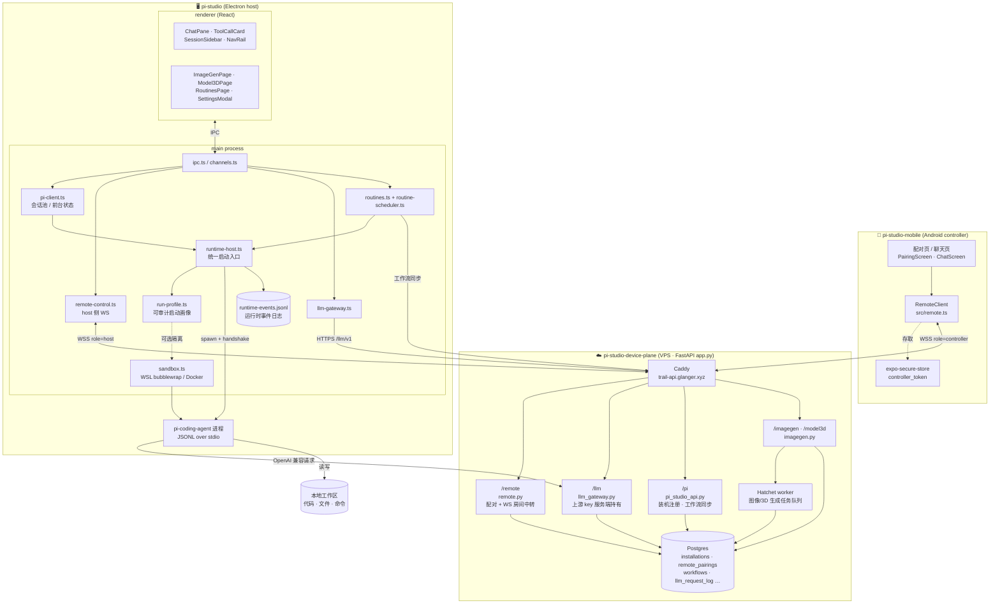
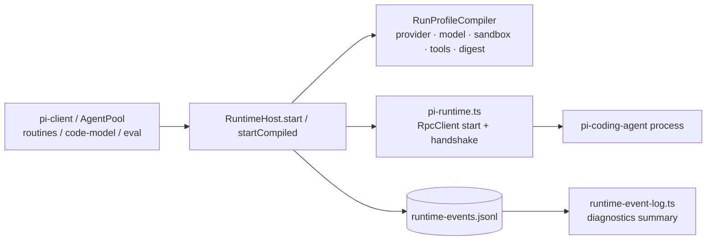
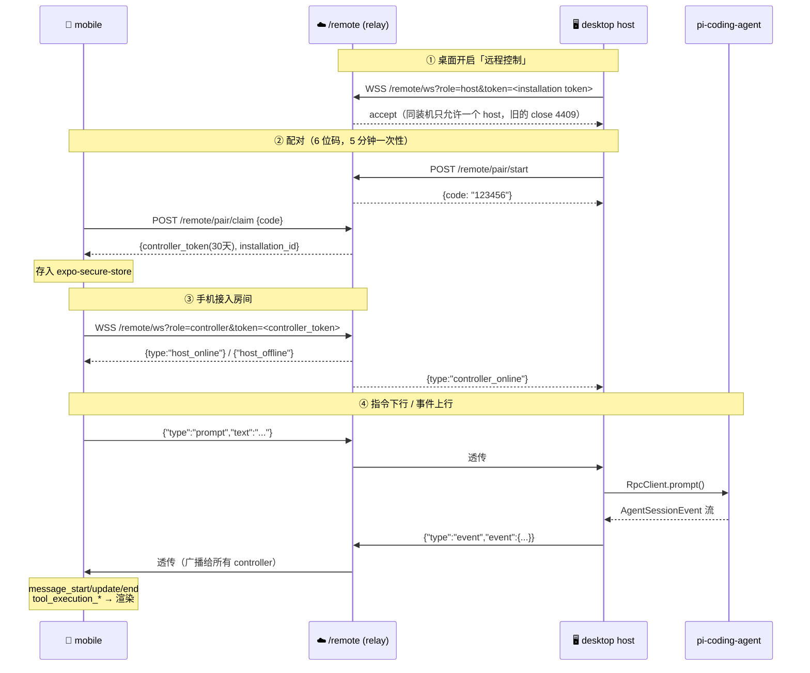

# pi-studio 整体架构

三个仓库组成一套「桌面 coding agent + 云服务 + 手机遥控」系统：

| 仓库 | 角色 | 技术栈 | 部署 |
|------|------|--------|------|
| `pi-studio` | 桌面主体（host） | Electron + electron-vite + React + antd | 本地 Windows/macOS 安装包 |
| `pi-studio-device-plane` | 云服务（API + 中转 + 网关） | FastAPI + Postgres + Hatchet | VPS，Caddy 反代 `trail-api.glanger.xyz` |
| `pi-studio-mobile` | 手机遥控端（controller） | Expo + React Native + TS | Android APK |

---

## 1. 全局拓扑



---

## 2. Agent Runtime Host

桌面端所有 Pi 进程启动都走 `RuntimeHost`：聊天、后台会话、例程、代码建模、Blender 建模、eval 复放使用同一个启动 seam。
调用者只表达“运行类型 + 工作区 + 少量审计上下文”；`RuntimeHost` 负责把它变成可启动、可诊断、可清理的运行实例。



这个 seam 刻意分清三种持久化事实：

- `run-profile.ts` 记录“为什么这样启动”：provider、model、sandbox、安全快照、profile digest；不记录 env secret。
- Pi 自己的 session JSONL 记录“用户/模型对话内容”，仍由 `getMessages()` 和会话导出读取。
- `runtime-events.jsonl` 记录“host 观察到的运行生命周期”：`run.started`、runtime event、`run.settled`、`cleanup`。diagnostics 读取的是投影摘要，不把 JSONL 文件格式暴露给 renderer。

这一步借鉴 Maka 的方向，但不照搬它的整体 runtime host：pi-studio 仍是 Electron host + 嵌入式 Pi harness + 云中转。现在先把启动和运行证据收敛到一个深模块，后续如果要做更完整的 event-sourced session inspect，可以在 `runtime-event-log.ts` 这一侧继续扩展。

两个约束很重要：

- main/headless 共用路径不能静态 import Electron。`RuntimeHost.startCompiled()` 要能在 eval CLI 里跑。
- 日志写入和读取失败都不能阻断 agent 启动；诊断证据是副作用，不是业务前置条件。

### 2.1 Desktop Session Kernel（逻辑模块）

`RuntimeHost` 只负责把一份 `RunProfile` 变成可运行、可诊断、可清理的实例；它不是完整的
会话内核。桌面侧真正的 Session Kernel 是以下模块共同形成的逻辑模块：

```text
pi-client                    对外 interface：工作区、活动会话和用户动作
  ├─ pi-agent-pool           backend 资源所有权、job 血缘与回收
  ├─ pi-event-projection     live runtime event 投影
  ├─ session-projection      durable history + live event 的 UI 读取模型
  └─ agent-runtime           workspace/runtime 状态快照
             │
             ▼
       AgentBackend seam
       ├─ Pi runtime adapter
       └─ ACP adapter
```

这里的 `Session Kernel` 是架构职责名，不要求新建一个把现有模块再包一层的类。深化方向是：

- 活动会话、进程所有权、待审批请求和 projection revision 各自只有一个权威 owner；
- Pi 与 ACP 只在 adapter 创建阶段分叉，共同生命周期在 pool/kernel 内收敛；
- renderer 只消费可重建快照，不通过事件顺序猜状态；
- control-plane task 与 desktop session 可关联但不共用状态机；
- Pi/ACP backend 继续拥有 agent loop、模型、tools/MCP 和 context policy，Electron 不复制 harness。

完整评审、状态所有权表和分阶段路线见
[Session Kernel 架构评审](session-kernel-architecture-2026-09-21.md)。

### 2.2 Control Plane Runtime Targets

`pi-studio-control-plane` 已经承担任务控制面的职责：任务入队、审批、lease、worker heartbeat、执行记录和巡检接口。它现在把可选执行目标显式声明成 runtime target contract，而不是让 mobile/backend 从字符串猜语义：

| target | role | execution_locus | 语义 |
|--------|------|-----------------|------|
| `auto` | `router` | `control-plane` | 控制面根据任务是否需要本地工具选择目标 |
| `pi-studio-engine` | `cloud-agent-runtime` | `cloud` | 云端 agent loop / provider / 云端工具 |
| `pi-studio:<device>` | `local-tool-runtime` | `gateway` | 通过 remote relay 进入用户设备，访问本地文件、shell、桌面 IPC、本地 MCP |

当前 `native-tools` 模式下，云端 `pi-studio-control-plane` 已经运行 Agent loop 和 Provider 调用；`pi-studio:<device>` 负责本地 tool gateway。桌面仍保留独立的 `desktop-agent` 模式，用于本地 Pi agent session，这两条执行链路不能混为一谈。

`pi-studio-control-plane` 的 dispatch 已经开始消费这个 contract：带 workspace、
`local_files_required=true` 或 `local-files` label 的任务会要求
`tool.local-files`，显式选到不具备该能力的 target 时 fail closed。当前只覆盖本地
文件这一类，后续再把 shell、desktop IPC 和 dynamic MCP 也映射成 runtime
capability。

它也已经有第一版 source-based 可恢复本地 tool operation 协议：

```text
cloud agent/runtime
  -> POST /harness/tool-operations {source: client|local|gateway}
  -> task.status = waiting_for_async_tool
  -> ToolOperationWorker claim pi-studio:<device>
  -> remote-control executeToolOperation
  -> POST /harness/tool-operations/{id}/resume {tool_result}
  -> task 回到 pending 并重新入队，下一次 ExecutionRequest.metadata 带 resumed_tool_results
```

当前桌面 gateway 实现 `shell.exec` / `bash`、`local.list`、`local.read` 和 `local.write`；
v2 shell 操作使用 scope v2，必须声明与命令相符的 `shell_read`、
`workspace_write`、`git_push`、`pull_request`、`production_deploy` 或
`destructive_command`，
桌面在调用 Pi 前再次校验。无法证明只读的命令按 `destructive_command` 处理。
desktop IPC 和本地 MCP 会复用同一个 operation envelope 继续加。模型 tool call 的
server/client/gateway 分流、持久化暂停、领取、执行和 `tool_result` 回灌已经由
Runtime 的 NativeToolExecutor、ToolTransport 和 Worker 组成闭环；后续重点是把
Runtime、Desktop、Mobile 的 envelope 收敛为单一版本化契约。

### 本地文件工具 v1

`capabilities.localTools` 列出已实现的工具，`localFileMaxBytes` 为 65536。
旧 host 没有这两个字段时，调用方不能推定它支持文件工具。

```json
{"type":"executeToolOperation","operationId":"toolop-1","toolName":"local.write","arguments":{"workspace":"D:\\Works\\example","path":"note.txt","content":"hello"}}
```

- 文件工具都要求 `arguments.workspace` 为桌面当前工作区的绝对路径；`path` 为工作区内相对路径。
- `local.list` 只枚举一层目录，默认返回 100 项，最多 200 项，结果按名称稳定排序并标记 `file`、`directory`、`symlink` 或 `other`；不会跟随符号链接继续遍历。
- `local.read` 返回 `{path, content, bytes, encoding: "utf-8"}`。
- `local.write` 接收 `content`，返回 `{path, bytes, encoding: "utf-8"}`。默认独占创建；显式 `overwrite: true` 时先写临时文件再替换。父目录必须存在。
- 仅处理不超过 64 KiB 的 UTF-8 文本；拒绝二进制、目录、符号链接、Windows junction、路径穿越和设备路径。大文件仍应走 artifact 通道。
- 工作区不匹配返回 `WORKSPACE_MISMATCH`；已存在、缺失文件等保留 `EEXIST` / `ENOENT`；错误经 worker 转成 `ok: false` 的持久化恢复结果。
- 这些是已认证 controller 的本机文件操作，不经过模型审批 UI；不把路径检查当作能隔离本机恶意进程并发替换目录的 OS 沙箱。

`PI_STUDIO_SMOKE_FILES=1` 可让发布 smoke 追加真实写入、拒绝重复创建、读回和持久化恢复队列检查。
它使用独立临时数据库并留下唯一命名的测试文件，不会创建正式业务任务。

### Workspace inventory

Runtime 可通过已认证的 controller 房间发送 `workspaceInventory`。桌面遍历当前及最近
工作区，在本机执行只读 Git 查询，返回 `path`、`kind`、`repository` 和 `defaultRef`。
GitHub 的 SSH / HTTPS remote 都归一化成 `owner/repo`；其他 Git 主机保留 host，URL 中的
用户名和密码不会返回，本地路径形式的 remote 也不会进入协议。

这个命令只报告事实，不在桌面保存 control-plane id。`pi-studio-control-plane` 负责把同一
repository 在不同电脑上的路径合并为一个稳定 `workspace_id` 和多条 executor binding。
Relay 仍然只做不透明转发，不拥有 Workspace Registry。

Runtime 的 `workspace_resolution.resolve_task_workspace` 统一任务入口和执行前的工作区解析：
入口按 `workspace_id` 校验注册记录与 repository；路由选定 executor 后，才从对应 binding
读取 `local_path`，填入兼容字段 `task.workspace` 和 `metadata.tool_transport.workspace`。
服务器不按自身操作系统规范化设备路径。已绑定任务遇到注册路径变化时拒绝执行，避免等待或审批后
静默切换目录；无 `workspace_id` 的旧路径型任务保留兼容行为。详见
[工作区解析收敛记录](workspace-resolution-2026-09-14.md)。

Runtime 的 `POST /execution-targets/resolve` 复用正式 ProviderCommand 归一化与路由规则，供客户端
只读预检目标、路径与拒绝原因，不创建任务或调用模型。结果不预留设备，也不代替执行时的权限与工具
能力验证。契约见 [Target Resolution v1](contracts/target-resolution-v1.md)；Mobile 仍保留原提交协议。

---

## 3. 手机遥控链路（本次新增的部分）

中转**不解析 payload**，纯文本帧透传；一个「装机(installation)」= 一个房间。
它只读信封的 `type`：为了就地回 ping，以及决定哪些帧要编号留底供重连补发（见下）。



**广播帧补发**：中转给 host 推来的广播帧（`event` / `hostEvent`）编号，并按房间留一小段
backlog（256 帧 / 4 MB 封顶）。controller 重连时用握手子协议 `pi-studio-resume.<seq>` 带上
自己的游标，只补断线期间错过的那一段；补发跑完才放它进房间，所以补发的帧一定排在实时帧前面。

补不上时（backlog 被挤掉，或两端都离开超过 5 分钟房间已重建）中转回
`{"type":"resume","complete":false}`，手机据此整体重取一次，而不是拿着有洞的事件流往下拼。

定向答复（`result`）和快照（`sessionProjection`）**不补发**：重连时那条请求早已被客户端
reject，补发只会被当成认不出的 id 丢掉；旧快照补过去反而会盖掉新的。中转仍然不解析
payload —— 它只读信封的 `type`。

**鉴权分层**：`role=host` 用桌面装机 token（比对 `installations.token_hash`）；
`role=controller` 用签名 token（`remote_pairings` + HMAC，30 天过期）。握手失败 close 4401。

⚠️ controller token = 对这台桌面的完全控制权（能跑命令、改代码）。

---

## 4. LLM 调用链路

上游 API key **只存在服务端**，桌面与 agent 都拿不到：

```
pi-coding-agent ──OpenAI 兼容请求──> trail-api/llm/v1/{profile_id}/chat/completions
                                      └─ llm_gateway.py 注入真实 key → 上游厂商
                                      └─ 全量记录 llm_request_log
```

桌面通过 `/llm/session-token` 换取短期凭据，再把 `baseUrl` 指给网关，
配置在 `src/main/llm-gateway.ts` 与 `agent-runtime-config.ts`。
`/llm/catalog` 同时下发可选 `model_metadata`，桌面优先使用云端给出的
`reasoning`、`contextWindow`、`cost`、`thinkingLevelMap`、兼容性标记；旧 catalog
没有 metadata 时才回退到本地模型名启发式判断。

Cloudflare Agent provider 额外暴露 `/provider/health` 时，桌面通过 backend 的
`/llm/profiles/{id}/provider-health` 代理读取健康状态。这个链路仍由 backend
注入 provider key，只把清洗后的 route stats、recent failures 和模型元数据返回到
renderer，用于排查多上游 failover、401/5xx 和长流式请求断连问题。

---

## 5. 关键文件索引

**桌面 `pi-studio/src/`**
- `main/runtime-host.ts` — Pi 运行实例的统一启动入口；集中处理 profile、cancellable startup、审计日志、runtime event 记录
- `main/run-profile.ts` — 编译可审计启动画像：provider、model、sandbox、安全快照、工具参数、profile digest
- `main/pi-runtime.ts` — 包装 `@earendil-works/pi-coding-agent` 的 `RpcClient`，负责 start、handshake、进程清理
- `main/pi-client.ts` — 前台聊天会话管理、事件投影、后台会话池协调
- `main/runtime-event-recorder.ts` / `main/runtime-event-log.ts` — host 级运行事件 JSONL 写入与 diagnostics 摘要投影
- `main/remote-control.ts` — host 侧 WS：收指令分发到 RpcClient、转发 agent 事件；`executeToolOperation` 是 control plane 下发本地 tool 的 gateway 入口
- `main/sandbox.ts` / `sandbox-wsl.ts` — 可选把 agent 关进 WSL bubblewrap 或 Docker
- `main/llm-gateway.ts` — 云端 LLM 网关对接
- `main/routines.ts` / `routine-scheduler.ts` — 定时例程
- `main/local-data-backup.ts` — 数据库打开前创建每日原子快照；恢复请求在重启后先校验、留保护点，再可回滚替换数据
- `renderer/src/components/ChatPane.tsx` — `segmentMessages` 折叠连续工具步、`ThinkingBlock`、流式 index
- `renderer/src/components/ToolCallCard.tsx` — 工具卡 + `SubagentCard`

**云端 `pi-studio-device-plane/`**
- `app.py` — 挂载 4 个 router
- `remote.py` — 配对 + WS 房间（`Room{host, controllers, seq, backlog}`）+ 重连补发
- `llm_gateway.py` — profile 管理 + `/v1` 透传
- `pi_studio_api.py` — 装机注册、workflow/run 同步
- `imagegen.py` + `hatchet-worker/` — 图像/3D 生成异步任务
- `database/migrations/` — 012 个迁移，`migrate.py` 随 systemd 启动自动执行

**手机 `pi-studio-mobile/src/`**
- `remote.ts` — `RemoteClient`：claim / WS / 指令 / 事件回调
- `protocol.ts` — 协议类型
- `screens/PairingScreen.tsx` · `screens/ChatScreen.tsx`
- `harness.ts` — Harness 控制面 client；接收 `role`、`execution_locus`、`capabilities` 形式的 runtime target contract

---

## 6. 现状与缺口

- 手机端只到 **P0**：纯文本渲染 assistant 消息，未做 Markdown / thinking 折叠 / 工具卡 / 子代理卡（见 `pi-studio-mobile/todo.md` P1–P2）
- 中转广播给**所有** controller，多设备同时连会各自收到全量事件流
- 会话状态仍然只存在 agent 子进程和本地 jsonl 里。中转的 backlog 只兜住重连那一小段，
  不是会话存储 —— 桌面不在线时手机依然什么都做不了
- control plane 已能声明并消费 runtime 角色/能力，并有 durable async tool operation 队列；`native-tools` 已接入云端 Agent loop、Provider transcript/resume 和桌面 shell、文本文件读写 gateway。桌面 Pi 进程仍作为独立的 `desktop-agent` 模式保留。当前主要缺口是跨仓库 ToolOperation 契约重复、目标解析重复，以及远程控制模块内部职责过宽。
